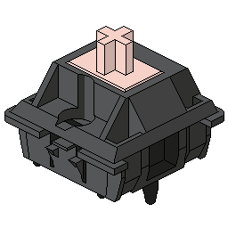

# My Portfolio Website! 

[View live here!](https://machkeys.vercel.app/)

## Details

The technologies used to make this website are React v18.2 with TypeScript, Next.js 12.3.1, and TailwindCSS v3.1.8. I've also used Framer-Motion v7.4.0 to create the simple animations for the website, and I used packages including react-simple-typewriter and tailwindcss-scrollbar for additional customization.

Of course I themed my website around my favorite hobby that is custom mechanical keyboards, and had to base my colors on some of my favorite keycap color themes:

GMK Olivia

Credits: Olivia, the designer behind GMK Olivia

SA Bliss

Credits: Minterly, the designer behind SA Bliss

I definitely spent some time browsing other developer's portfolio sites before I got a good idea about how I wanted mine to look, and I had my up's and down's while coding everything, but I had a fun time overall and even drew my own pixel art! I'm definitely proud with how they turned out, although I definitely needed to look at some examples as it was my first time with pixel art.

